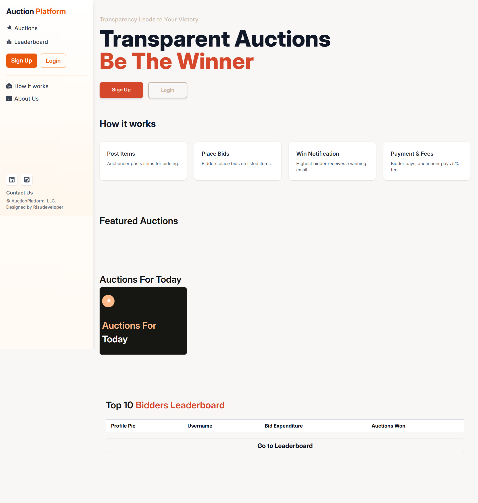
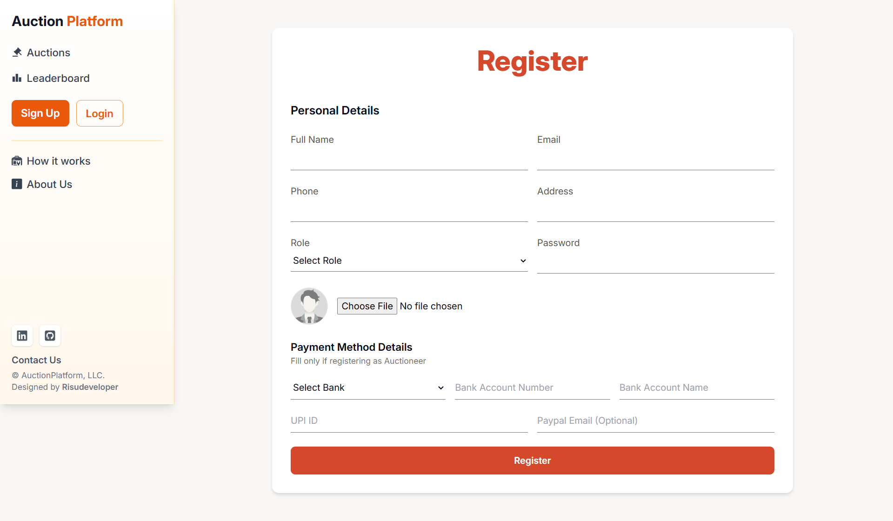
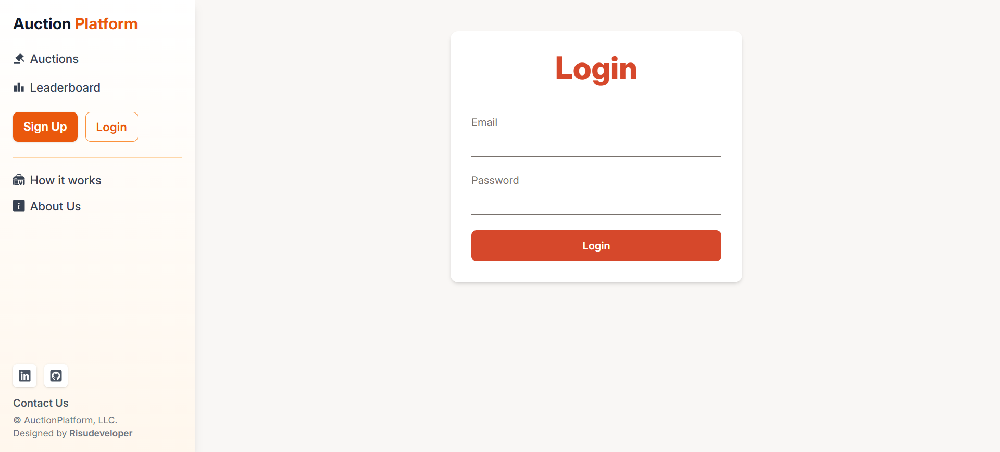
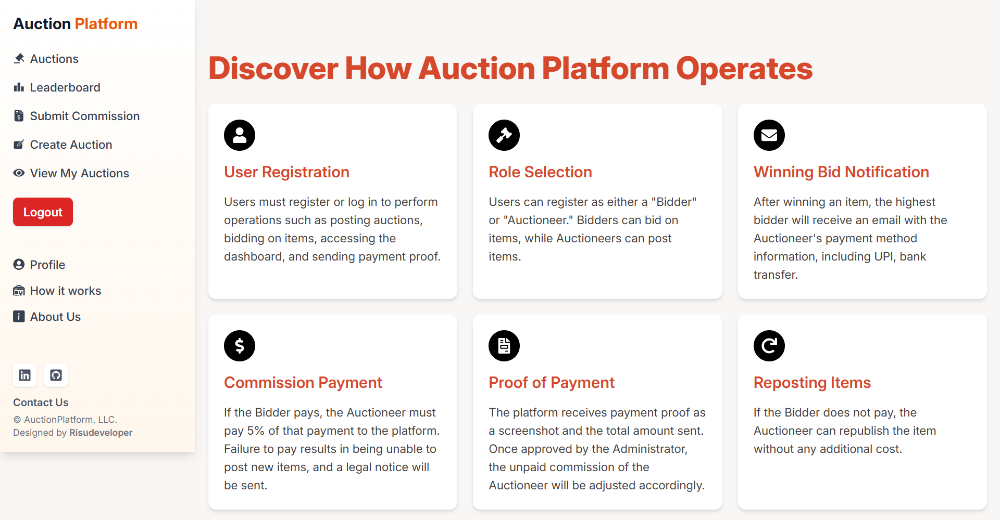
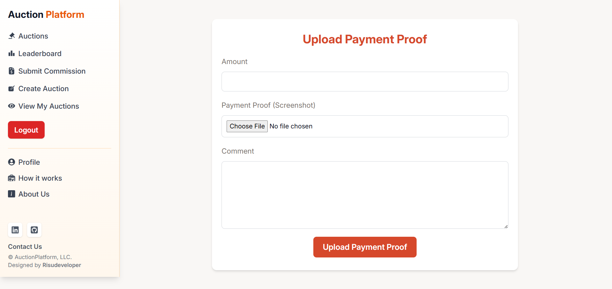
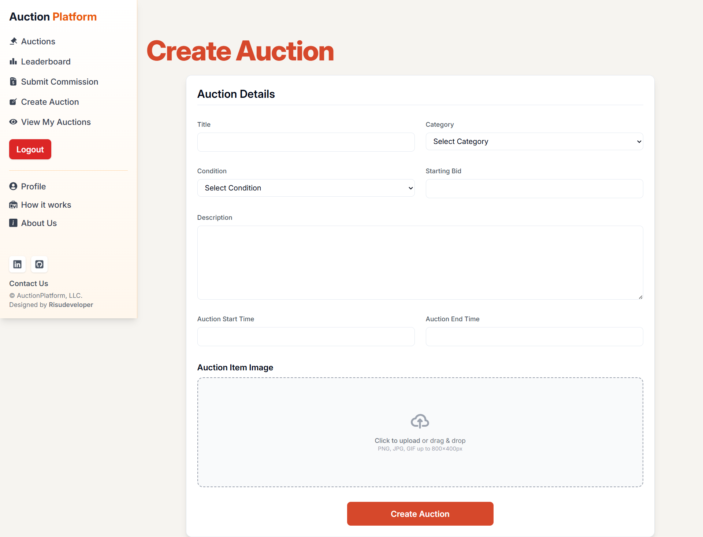
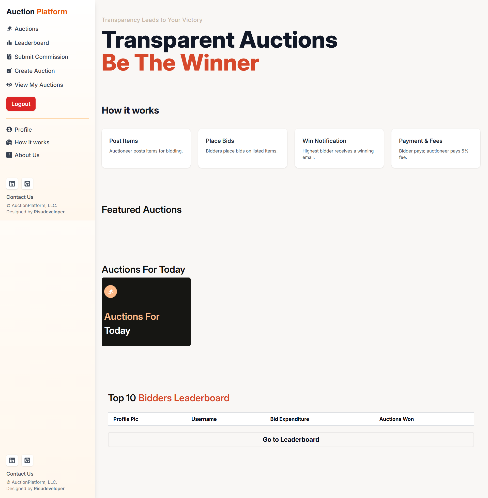

# Auction Platform Frontend

A full-stack **Auction Platform** built with the **MERN stack** and **TailwindCSS** that allows users to register, browse, and place bids on auction items, while sellers can manage products, create auctions, and oversee bidding processes. The platform supports multiple auction types and email notifications for bid activities.
---

## Features

### User Functionalities
- **User Registration and Profiles:**  
  Users can register with details such as name, email, and contact information, and manage their profiles.  
- **Item Viewing:**  
  Browse auction items with detailed descriptions, images, and seller ratings.  
- **Bid History Logs:**  
  Track the progression of your bids through a dedicated dashboard.  
- **Bidding Options:**  
  Place bids in different auction types including traditional, reverse, and sealed bid auctions.  
- **Notifications:**  
  Receive email notifications when outbid using **SendGrid/Nodemailer** integration.

### Seller Functionalities
- **Seller Registration and Accounts:**  
  Sellers can create accounts and register their products.  
- **Product Management (CRUD):**  
  Create, read, update, and delete product listings through a user-friendly interface.  
- **Auction Categories:**  
  Organize auctions into categories like cars, bikes, etc.  
- **Seller Dashboard:**  
  Manage auctions, track status, and update auction details easily.  
- **Inventory Management:**  
  Track unsold items and manage inventory efficiently.  
- **Auction Oversight:**  
  Monitor ongoing auctions and manage disputes to ensure compliance with platform rules.

---

## Tech Stack
- **Frontend:** React.js, TailwindCSS  
- **Backend:** Node.js, Express.js  
- **Database:** MongoDB  
- **Email Notifications:** SendGrid or Nodemailer  
- **Postman:** For API Testing 
- **Authentication:** JWT (JSON Web Tokens)  
- **Deployment:** Netlify (Frontend), Render (Backend)

---

## Usage

- Open the application in your browser at https://spontaneous-belekoy-9cf309.netlify.app/.

- Register as a User or Seller.

- Users can browse items, view details, and place bids.

- Sellers can create auctions, manage products, and track bids.

- Receive email notifications for bid updates.

## Deployment

- **Frontend**: https://spontaneous-belekoy-9cf309.netlify.app/

Push all code to GitHub and submit your URLs for assessment.

## Screenshots

## Developed by [Riswan N]

